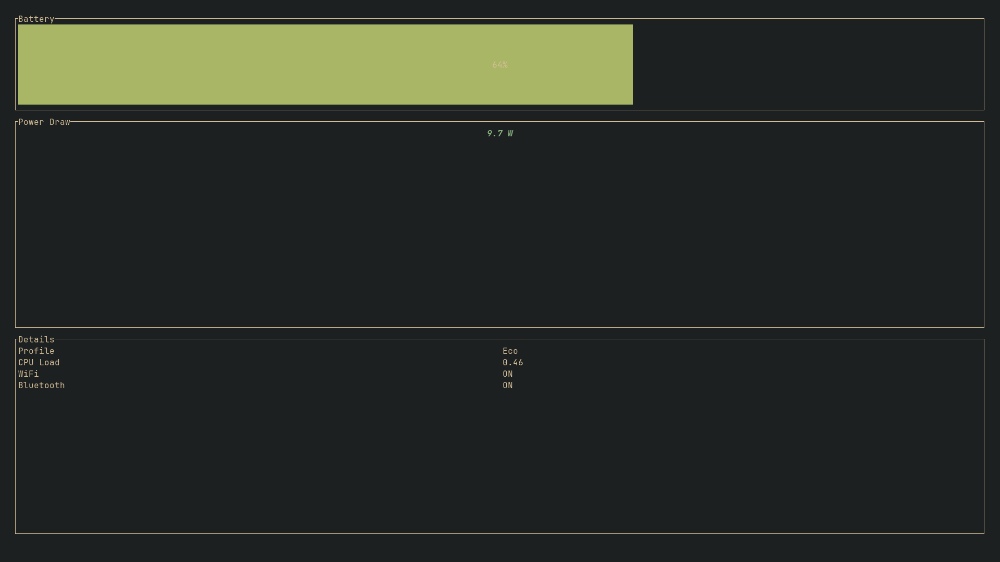

# Nitro
> **A Kernel-level Battery Saver & TUI Dashboard for Gaming Laptops.**



**Nitro** is a background service written in Rust designed to extend battery life on Ryzen-based Gaming laptops using Linux. It bypasses BIOS power limits to enforce strict TDP constraints using `ryzenadj`.

## Distributed Architecture

Nitro uses a split-process architecture to separate privileged hardware control from the user interface.

```ascii
+-----------------+       +-----------------+       +-----------------+
|                 |       |                 |       |                 |
|   nitro-daemon  | <---> | Unix Domain Sock| <---> |    nitro-gui    |
|   (Root/System) |       | /tmp/nitro.sock |       |   (User/TUI)    |
|                 |       |                 |       |                 |
+-----------------+       +-----------------+       +-----------------+
        |
        v
  [Hardware/RyzenAdj]
```

- **nitro-daemon**: Runs as root. Enforces hardware limits, monitors sensors, and fights back against BIOS power resets.
- **nitro-gui**: Runs as user. A Ratatui-based TUI for visualization and control.
- **IPC**: Uses Unix Domain Sockets for low-latency, bi-directional communication.

## Key Features

### Aggressive Power Management
- **Monk Mode**: Caps CPU at **5W** (Sustained) / **8W** (Burst). Maximum battery life.
- **Eco Mode**: Caps CPU at **8W** / **15W**. Balanced performance for web browsing.
- **Pro Mode**: Unleashes **25W+**. Full performance for gaming or compiling.

### Bios Fight-Back
The daemon aggressively reapplies power limits every 2 seconds (and immediately upon unplugging) to override BIOS watchdogs that attempt to reset TDP to default high values.

### Real-Time Dashboard
Visualizes:
- Power Draw (Watts)
- CPU Load
- Active Profile
- Battery Percentage (with color coding)

## Requirements

- **OS**: Arch Linux (Recommended)
- **Hardware**: AMD Ryzen CPU (Rembrandt/Cezanne or similar)
- **Dependencies**:
  - `ryzenadj-git` (for TDP control)
  - `ryzen_smu-dkms-git` (Kernel Module for ryzenadj)
  - `cpupower` (optional, for frequency scaling)

## Installation Guide

### 1. Build
```bash
cargo build --release
```

### 2. Install Binaries
```bash
sudo cp target/release/nitro-daemon /usr/local/bin/
sudo cp target/release/nitro-gui /usr/local/bin/
```

### 3. System Service
Create a systemd service file at `/etc/systemd/system/nitro-daemon.service`:

```ini
[Unit]
Description=Nitro Battery Saver Daemon
After=network.target

[Service]
ExecStart=/usr/local/bin/nitro-daemon
Restart=always
User=root
Group=root

[Install]
WantedBy=multi-user.target
```

Enable and start the service:
```bash
sudo systemctl enable --now nitro-daemon
```

### 4. Desktop Entry
Create a desktop entry for the GUI at `~/.local/share/applications/nitro.desktop`:

```ini
[Desktop Entry]
Type=Application
Name=Nitro Battery
Exec=/usr/local/bin/nitro-gui
Terminal=true
Categories=System;Monitor;
```

## Usage

Launch `nitro-gui` from your terminal or search for "Nitro Battery" in your application launcher.

### Keybindings

| Key | Action | Description |
| :---: | :--- | :--- |
| **m** | **Monk Mode** | Strict Battery Saving (5W) |
| **e** | **Eco Mode** | Balanced (8W) |
| **p** | **Pro Mode** | Performance (25W+) |
| **q** | **Quit** | Exit the GUI |

## Disclaimer

**USE AT YOUR OWN RISK.**
This software manipulates hardware power limits using `ryzenadj`. While generally safe on modern hardware with thermal protections, the authors are not responsible for any hardware damage, data loss, or instability caused by using this software.
